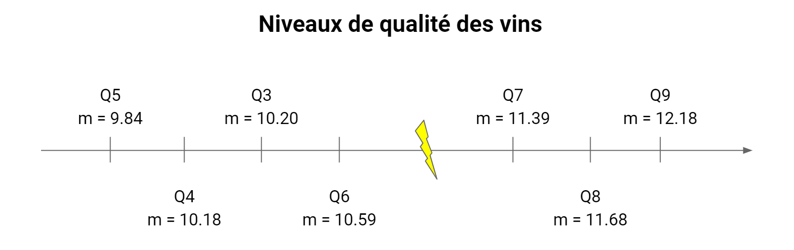
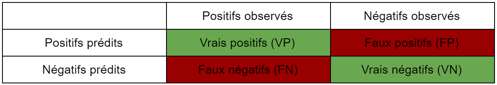

```{r setup, include=FALSE}
knitr::opts_chunk$set(echo = TRUE)
```

# Introduction

Le jeu de données sur lequel nous avons basé notre étude statistique provient du site UC Irvine Machine Learning Repository, qui recense plus de 480 jeux de données mis à contribution à des fins d’apprentissage pour les intelligences artificielles. Ces données, récoltées en 2009, concernent différentes variantes du "Vinho Verde", vin produit dans le Minho, région du nord-ouest du Portugal.

Les variables traitées dans ce jeu de données se rapportent à des paramètres physico-chimiques (taux d'alcool, quantité d'acide citrique,...) et à la qualité gustative de chaque vin. À partir de celles-ci, nous allons effectuer quatre tests statistiques et nous allons mettre en place deux modèles de régression.

# I/ Présentation des données 

Le jeu de données étudié ici est constitué de deux fichiers, "winequality-white.csv", qui contient des données de 4898 Vinhos Verdes blancs et "winequality-red.csv", qui contient les mêmes données pour 1599 vins rouges. La population analysée est les différentes variantes de Vinhos Verdes et l'unité statistique représente un vin. Les variables prises en compte dans les deux fichiers sont : 

* __“Fixed acidity”__ (variable quantitative continue) : correspond au total d’acides présent dans un vin (acide tartrique, acide lactique, acide citrique, acide malique).

* __“Volatile acidity”__ (variable quantitative continue) : correspond à la quantité d’acides distillables en vapeur présente dans un vin (acide acétique principalement).

* __“Acide citric”__ (variable quantitative continue) : quantité d’acide citrique présente dans un vin.

* __“Residual sugar”__ (variable quantitative continue) : quantité de sucre naturellement présente dans le raisin après la fermentation alcoolique.

* __“Chlorides”__ (variable quantitative continue) : matière minérale contenue naturellement dans le vin, comme le sel (chlorure de sodium).

* __“Free sulfur dioxide”__ (variable quantitative continue) : dioxyde de soufre présent sous forme de molécule libre (c’est à dire non liée à d’autres molécules) dans le vin ; propriétés antiseptiques et antioxydantes.

* __“Total sulfur dioxide”__ (variable quantitative continue) : tient compte des molécules de dioxyde de soufre libres mais aussi de celles ayant des liaisons avec d’autres éléments chimiques.

* __“Density”__ (variable quantitative continue) : densité d’un vin.

* __“pH”__ (variable quantitative continue) : mesure de l’acidité d’un vin, allant de 1 à 14.

* __“Sulphates”__ (variable quantitative continue) : similaire au dioxyde de soufre, propriétés antiseptiques et antioxydantes pour le vin.

* __“Alcohol”__ (variable quantitative continue) : degré d’alcool présent dans un vin.

* __“Quality”__ (variable qualitative ordinale) : degré d’appréciation d’un vin par des experts, allant de 0 (très mauvais) à 10 (excellent). 

Afin de réaliser une étude statistique approndie prenant en compte la couleur des vins, nous avons décidé de regrouper les deux fichiers en une grande matrice intitulée __"DataVins"__, qui contient les 6497 vins. Nous avons ajouté une colonne __"Type"__ à chaque vin, qui contient la couleur associée au vin en question (variable qualitative nominale).

```{r, echo = FALSE , include = FALSE}
#install.packages("tinytex")
#install.packages("corrplot")
#install.packages("caret")
#install.packages("knitr")
#install.packages("rmarkdown")
#install.packages("markdown")
library(tinytex)
library(corrplot)
library(caret)
library(knitr)
library(rmarkdown)
library(markdown)
```


```{r, echo = FALSE}

vinsBlancs = read.table(file = "winequality-white.csv", sep = ";", header = T)
type = rep("blanc", length = nrow(vinsBlancs))
vinsBlancs = cbind(vinsBlancs, type)

vinsRouges = read.table(file = "winequality-red.csv", sep = ";", header = T)
type = rep("rouge", length = nrow(vinsRouges))
vinsRouges = cbind(vinsRouges, type)

dataVins = rbind(vinsBlancs, vinsRouges)

dataVins$quality = as.factor(dataVins$quality)

kable(summary(dataVins[,1:6]))
kable(summary(dataVins[,7:12]))

boxplot(scale(dataVins[,1:11]),las =2, main = "Répartitions normalisées des différentes variables ")

```

# II/ Analyse du jeu de données

# A) Test \(\epsilon\)

Tout d'abord, nous nous sommes posés la question suivante :

__Le taux d’alcool présent dans un vin est-il significativement différent en fonction du type (blanc ou rouge) de celui-ci ?__


```{r, echo = FALSE}
boxplot(dataVins$alcohol~dataVins$type, xlab = "Couleur", ylab = "Taux d'alcool", main = "Répartition du taux d'alcool en fonction de la couleur du vin")
```

Pour répondre à cette question, nous allons effectuer un test de comparaison de moyennes dans le cas de grands échantillons, c'est à dire un test \(\epsilon\). Le but va être de comparer les moyennes d'une même variable quantitative sur deux échantillons distincts.

La variable aléatoire étudiée ici est X : le taux d'alcool présent dans un vin.

Nous formulons les hypothèses H~0~ : µ~blanc~ = µ~rouge~ et H~1~ : µ~blanc~ != µ~rouge~.

Etant donnée la taille des échantillons (n > 30 individus), nous n'avons pas besoin de vérifier de conditions d'application.

```{r, echo = FALSE}
student = t.test(dataVins$alcohol~dataVins$type, var.equal = 1)
```

A l'issue du test \(\epsilon\) réalisé sur ces deux échantillons, on obtient une p-value de `r round(student$p.value,digits = 3)`. Au risque \(\alpha\) = 5%, le test est donc significatif et on rejette H~0~. Il y a bien une différence dans le taux d'alcool des vins blancs et des vins rouges ; les Vinhos Verdes blancs sont plus alcoolisés que les rouges. 

\newpage

# B) Test de corrélation de Pearson

Dans un second temps, nous nous sommes interrogés : 

__Le pH d’un vin dépend-il de son taux d’alcool ?__

Dans cette optique, nous allons réaliser un test de corrélation de Pearson. Ce test a pour but d'étudier le lien entre deux variables quantitatives.

Les variables aléatoires que nous utilisons ici sont X : le pH d'un vin et Y : son taux d'alcool.

Les hypothèses du test sont H~0~ : il n'y a pas de lien entre les deux variables et H~1~ : il existe un lien entre les deux variables.

Comme nous travaillons sur de grands échantillons (n > 30 individus), nous n'avons pas de conditions d'application à vérifier.

```{r, echo = FALSE}
pearson = cor.test(dataVins$alcohol, dataVins$pH)
```

En effectuant ce test de corrélation de Pearson, on a une p-value égale à `r round(pearson$p.value, digits = 24)`. Par conséquent, au risque \(\alpha\) = 5%, le test est significatif et on rejette H~0~. Il y a un lien entre le pH et le taux d'alcool. Cependant, ces deux variables ne sont que très faiblement corrélées. En effet, on obtient un coefficient de corrélation de seulement `r round(pearson$estimate,digits = 2)`.

```{r, echo = FALSE}
droiteCor = lm(dataVins$pH~dataVins$alcohol)

plot(dataVins$alcohol, dataVins$pH, xlab = "Taux d'alcool du vin", ylab = "pH du vin", main = "Droite de régression linéaire entre le pH du vin et son taux d'alcool")

abline(droiteCor, col = "Red")
```

\newpage

# C) Anova

Ensuite, nous nous sommes demandés : 

__Le taux d’alcool est-il significativement différent en fonction des différents niveaux de qualité du vin ?__

```{r, echo = FALSE, include = FALSE}
by(dataVins$alcohol, dataVins$quality, FUN = mean)
by(dataVins$alcohol, dataVins$quality, FUN = var)
```
```{r, echo = FALSE}
boxplot(alcohol ~ quality, data = dataVins, xlab = "Niveaux de qualité du vin", ylab = "Taux d'alcool", main = "Répartition du taux d'alcool en fonction de la qualité des vins")
```
Pour cela, nous allons faire un test Anova. Ce test a pour but de comparer les moyennes d'une même variable aléatoire quantitative sur plusieurs échantillons.

Nous allons utiliser la variable aléatoire X : le taux d'alcool d'un vin, avec le facteur F : la qualité du vin, à 7 niveaux (de 3 à 9)

On a les deux hypothèses H~0~ : µ~3~ = µ~4~ = µ~5~ = ... = µ~9~ et H~1~ : au moins une des moyennes est différente.

Comme la taille des échantillons est importante, nous n'avons pas de conditions d'application à vérifier.
```{r, echo = FALSE}

# bartlett.test(alcohol ~ quality, data = dataVins)

anovaVins = aov(alcohol ~ quality, data = dataVins)

# summary(anovaVins)
```

Ce test Anova nous donne une p-value inférieure à $2e^{-16}$. On peut donc en conclure que le test est significatif pour un risque \(\alpha\) = 5%. Par conséquent, on rejette H~0~, au moins une des moyennes est différentes. Afin d'identifier les points de différences entre les moyennes, nous allons réaliser des tests post-hoc.

\newpage

```{r, echo = FALSE}
pairwise.t.test(x = dataVins$alcohol, g = dataVins$quality, "bonferroni")
```
```{r, echo = FALSE, include=FALSE}
plot(TukeyHSD(anovaVins), las = 2)
```

Grâce à ces informations, il nous est possible d'identifier les différences significatives entre les moyennes, représentées sur la figure ci-dessous.



# D) Test du khi2

La quatrième question que nous nous sommes posés est la suivante :

__La qualité d’un vin est-elle indépendante de sa couleur ?__

Pour répondre à cette interrogation, nous allons devoir effectuer un test du khi2. L'objectif de ce type de tests est d'étudier l'indépendance entre deux variables quantitatives.

Nous avons ici deux variables aléatoires, X : la couleur du vin et Y : la qualité du vin.

On formule les deux hypothèses H~0~ : les variables sont indépendantes et H~1~ : les variables sont liées.

```{r, echo = FALSE, include=FALSE}
chi2 = chisq.test(dataVins$quality, dataVins$type, correct = FALSE)
kable(chi2$observed)
```

Lorsque l'on effectue le test du khi2 sur nos données, on obtient le tableau des effectifs théoriques suivant :

```{r, echo = FALSE}
kable(chi2$expected)
```

Dans les effectifs théoriques, on remarque que la case de qualité 9 pour les vins blancs et les vins rouges compte moins de 5 individus, nous allons donc refaire un test du khi2 en regroupant les classes de qualité 8 et 9.

```{r, echo = FALSE}
qualiteRegroupee = dataVins$quality
qualiteRegroupee[which(qualiteRegroupee == 9)] = 8
chi2Regroupe = chisq.test(qualiteRegroupee, dataVins$type, correct = FALSE)
```
```{r, echo = FALSE, include = FALSE}
chi2Regroupe$expected
```

Après avoir réalisé le test du khi2 avec ce nouveau tableau d'effectifs regroupés, on obtient une p-value de `r round(chi2Regroupe$p.value,digits = 24)`. Au risque \(\alpha\) = 5%, on peut donc affirmer que le test est significatif. La qualité d'un vin est influencée par sa couleur; les Vinhos Verdes blancs ont tendance à être meilleurs que les rouges.


# E) Modèles de régression

Nous allons à présent créer des modèles de prédiction de différentes variables. Dans cette étude, nous nous intéresserons à deux types de modèles de régression. D’un côté, nous avons les modèles de régression linéaire, qui consistent à prédire une variable quantitative en fonction d’une ou plusieurs variables quantitatives. De l’autre, on a les modèles de régression logistique binaire, qui ont pour finalité la prédiction d’une variable qualitative à deux classes en fonction d’une ou plusieurs variables qualitatives ou quantitatives.

La première étape, pour la création d'un modèle de régression, consiste à effectuer un nettoyage des données. Pour cela, on commence par supprimer les NA. On observe qu’il n’existe aucune donnée de ce type dans la base de données. Ensuite, on supprime les variables à variance nulle. De même, nous n’en avons pas dans notre jeu de données. La dernière étape consiste à se débarrasser des valeurs aberrantes. Après avoir affiché la matrice de données en boite à moustache (boxplot), on remarque que certaines valeurs, pour residual.sugar, free.sulfur.dioxide et density, sont très élevées par rapport au reste de la population. On choisit donc de supprimer les vins pour lesquels ces variables sont trop importantes. Cela correspond à un residual.sugar supérieur à 40, à un free.sulfur.dioxide supérieur à 200, et à une density supérieure à 1.005. On vérifie ensuite la taille de la matrice, 4 vins ont été supprimés.

```{r, echo = "FALSE", include = "FALSE"}
# nettoyage
nrow(dataVins)
boxplot(dataVins$fixed.acidity)
boxplot(dataVins$volatile.acidity)
boxplot(dataVins$citric.acid)
boxplot(dataVins$residual.sugar)
#suppression d'un vin
dataVins = dataVins[-which(dataVins$residual.sugar>=40),]
boxplot(dataVins$chlorides)
boxplot(dataVins$free.sulfur.dioxide)
#suppression d'un vin
dataVins = dataVins[-which(dataVins$free.sulfur.dioxide>=200),]
boxplot(dataVins$total.sulfur.dioxide)
boxplot(dataVins$density)
#suppression de deux vins
dataVins = dataVins[-which(dataVins$density>=1.005),]
boxplot(dataVins$pH)
boxplot(dataVins$sulphates)
boxplot(dataVins$alcohol)
#suppression de 3 vins au total
nrow(dataVins)
boxplot(scale(dataVins[,1:11]), las = 2, main = "Distribution des variables du jeu de données")
```

### Régression linéaire multiple

Le premier modèle de prédiction créé est un modèle de régression linéaire multiple. Le but de celui-ci est de prédire le taux d'alcool d'un vin en fonction de toutes les autres variables quantitatives du jeu de données.

On a donc comme variables aléatoires X : le taux d’alcool d’un vin et Y~1~ : le pH du vin, Y~2~ : sa densité, Y~3~ : le total de dioxyde de soufre, etc...

On crée tout d’abord une matrice contenant uniquement les variables que nous étudirons pour les modèles. Ensuite, on sépare la population en deux échantillons : l’échantillon d’apprentissage et l’échantillon test. L’échantillon d’apprentissage contient deux tiers de la population, tirés au hasard. On crée, par la suite, l’échantillon test contenant le reste des individus.

On crée ensuite le modèle à partir de l’échantillon d’apprentissage et on étudie l’implication des descripteurs. On obtient les résultats suivants :

```{r, echo = FALSE, include=FALSE}
# Suppression des descripteurs qu'on ne veut pas étudier :
matModele1 = dataVins
matModele1 = matModele1[ , -which(colnames(matModele1) == "type")]
matModele1 = matModele1[ , -which(colnames(matModele1) == "quality")]

boxplot(matModele1, las = 2)

# Constitution de l'échantillon d'apprentissage (2/3 des valeurs) :
vIndApp = sample(1 : dim(matModele1)[1], size = round(2*dim(matModele1)[1] / 3,0))
matApp = matModele1[vIndApp,]
# Constitution de l'échantillon de test (1/3 des valeurs) :
vIndTest = setdiff(1:nrow(matModele1), vIndApp)
vIndTest = (1:nrow(matModele1))[-vIndApp]
matTest = matModele1[vIndTest,]

apply(matApp, 2, hist)
apply(matTest, 2, hist)
```
```{r, echo = FALSE}
# Création du modèle
fit2 = lm(alcohol~., data = as.data.frame(matApp))
kable(summary(fit2)$coefficients)
```

On voit que les descripteurs chlorides et free.sulfur.dioxide ont une p-value supérieure à 5%. On peut donc en conclure que ces descripteurs ne permettent pas de prédire le taux d'alcool d'un vin. En revanche, on observe que toutes les autres variables ont une p-value très proche de 0 (les résultats obtenus sur le tableau ci-dessus sont arrondis). Par conséquent, nous allons créer un nouveau modèle en gardant uniquement les descripteurs significatifs.

```{r, echo = FALSE, include=FALSE}
# Suppression des descripteurs inutiles (non significatifs) :
matModele1 = matModele1[ , -which(colnames(matModele1) == "chlorides")]
matModele1 = matModele1[ , -which(colnames(matModele1) == "free.sulfur.dioxide")]

boxplot(matModele1, las = 2)

# Constitution de l'échantillon d'apprentissage (2/3 des valeurs) :
vIndApp = sample(1 : dim(matModele1)[1], size = round(2*dim(matModele1)[1] / 3,0))
matApp = matModele1[vIndApp,]
# Constitution de l'échantillon de test (1/3 des valeurs) :
vIndTest = setdiff(1:nrow(matModele1), vIndApp)
vIndTest = (1:nrow(matModele1))[-vIndApp]
matTest = matModele1[vIndTest,]

apply(matApp, 2, hist)
apply(matTest, 2, hist)

# Création du modèle
fit2 = lm(alcohol~., data = as.data.frame(matApp))
summary(fit2)
```

Pour vérifier la validité de ce modèle, il faut vérifier que les résidus observés \(\epsilon\)~i~ (avec \(\epsilon\)~i~ = y~i~ - ŷ~i~) reflètent les propriétés des vraies erreurs inconnues \(\epsilon\)~i~. Pour cela, il faut que : 
La répartition des résidus constitue une loi normale,
L’espérance des résidus soit nulle,
L’homoscédasticité des résidus soit vérifiée,
Les résidus soient indépendants les uns des autres.
Si ces conditions sont respectées, cela signifie que le modèle appris est vraisemblablement correct.

```{r, echo=FALSE, include=FALSE}
# Prédiction en fonction du modèle crée (sur l'échantillon d'apprentissage), RESUBSTITUTION :
yobsApp = matApp[,"alcohol"]
ypredApp = predict(fit2, newdata = as.data.frame(matApp))
plot(yobsApp, ypredApp, xlab = "valeurs observées", ylab = "valeurs prédites", main = "test")
cor(yobsApp,ypredApp)

# Prédiction en fonction du modèle crée (sur l'échantillon de test), GENERALISATION :
yobsTest = matTest[,"alcohol"]
ypredTest = predict(fit2, newdata = as.data.frame(matTest))
plot(yobsTest, ypredTest, xlab = "valeurs observées", ylab = "valeurs prédites", main = "test")
cor(yobsTest,ypredTest)
```
```{r, echo=FALSE}
# Etude des résidus
residus = fit2$residuals
# L'espérance (moyenne) des résidus doit être proche de 0 
theta = mean(residus)
# Les résidus doivent suivre une loi normale
hist(residus, xlab =  "Résidus", ylab =  "Densité", br = 40, prob = T, main = bquote(m[residus] == .(theta)))
newx = seq(min(residus), max(residus), by = 0.01)
lines(newx, dnorm(x = newx, mean = mean(residus), sd = sd(residus)), col = 2)
```

```{r, echo=FALSE}
# Leur variance doit être constante
plot(fit2$fitted.values, fit2$residuals, ylab = "residus", xlab = "valeurs de karnofsky predites")
abline(h = 1, col="red")
abline(h = -1, col="red")
```

Graphiquement, on voit que les résidus s'alignent sur une loi normale. De plus, l'espérance est très proche de 0 (quasiment nulle). De même, on observe que l'homoscédasticité est respectée. Les résidus montrent donc que le modèle est exploitable. En ce qui concerne les performances du modèle, on trouve $R^{2}$ = `r round(summary(fit2)$r.squared,digits = 2)` et $R^{2}ajusté$ = `r round(summary(fit2)$adj.r.squared,digits = 2)`. Comme ces valeurs sont proches de 1, on peut en conclure que le modèle créé est fiable et utilisable.

### Régression logistique multiple

Le second modèle de prédiction réalisé est, quant à lui, un modèle de régression logistique multiple. Le but de celui-ci est de prédire la qualité d'un vin (bon ou mauvais), en fonction de toutes les variables quantitatives du jeu de données.

On a donc comme variables aléatoires X : la qualité d'un vin et Y~1~ : le pH du vin, Y~2~ : sa densité, Y~3~ : le total de dioxyde de soufre, etc...

On commence tout d'abord par séparer les valeurs de qualité des vins en deux classes distinctes, bon (pour une qualité supérieure à 5) et mauvais (pour une qualité inférieure ou égale à 5).

Ensuite, comme pour le précédent modèle, on crée tout d’abord une matrice contenant uniquement les variables que nous étudions pour les modèles. Ensuite, on sépare la population en deux échantillons : l’échantillon d’apprentissage et l’échantillon test. L’échantillon d’apprentissage contient deux tiers de la population, tirés au hasard. On crée, par la suite, l’échantillon test contenant le reste des individus.

Lorsque l’on crée le modèle en fonction de l’échantillon d’apprentissage et que l’on étudie l’implication des descripteurs on obtient les résultats suivants :

```{r, echo=FALSE, include=FALSE}
matModele2 = dataVins
summary(dataVins)

# séparation des valeurs de qualité en 2 classes distincts (bon ou mauvais)
matModele2$quality = as.numeric(as.character(matModele2$quality))
matModele2$quality[which(matModele2$quality == 1 | matModele2$quality == 2 | matModele2$quality == 3 | matModele2$quality == 4 | matModele2$quality == 5)] = "mauvais"
matModele2$quality[which(matModele2$quality == 6 | matModele2$quality == 7 | matModele2$quality == 8 | matModele2$quality == 9 | matModele2$quality == 10)] = "bon"
matModele2$quality = as.factor(matModele2$quality)

# Suppression des descripteurs qu'on ne veut pas étudier :
matModele2 = matModele2[ , -which(colnames(matModele2) == "type")]

boxplot(matModele2, las = 2)

# Constitution de l'échantillon d'apprentissage (2/3 des valeurs) :
vIndApp = sample(1 : dim(matModele2)[1], size = round(2*dim(matModele2)[1] / 3,0))
matApp = matModele2[vIndApp,]

# Constitution de l'échantillon de test (1/3 des valeurs) :
vIndTest = setdiff(1:nrow(matModele2), vIndApp)
vIndTest = (1:nrow(matModele2))[-vIndApp]
matTest = matModele2[vIndTest,]
```
```{r, echo=FALSE}
# Création du modèle
fit = glm(quality~., data = as.data.frame(matApp), family="binomial")
kable(summary(fit)$coefficients)
```

On observe que les descripteurs fixed.acidity, citric.acid, chlorides, density et pH ont une p-value supérieure à 5%. On peut donc en conclure que ces descripteurs ne permettent pas de prédire la qualité d'un vin. En revanche, on observe que toutes les autres variables ont une p-value très proche de 0 (les résultats obtenus sur le tableau ci-dessus sont arrondis). Par conséquent, nous allons créer un nouveau modèle en gardant uniquement les descripteurs significatifs.

```{r, echo=FALSE, include=FALSE}
# Suppression des descripteurs inutiles (non significatifs) :
matModele2 = matModele2[ , -which(colnames(matModele2) == "fixed.acidity")]
matModele2 = matModele2[ , -which(colnames(matModele2) == "citric.acid")]
matModele2 = matModele2[ , -which(colnames(matModele2) == "chlorides")]
matModele2 = matModele2[ , -which(colnames(matModele2) == "pH")]
matModele2 = matModele2[ , -which(colnames(matModele2) == "density")]

boxplot(matModele2, las = 2)

# Constitution de l'échantillon d'apprentissage (2/3 des valeurs) :
vIndApp = sample(1 : dim(matModele2)[1], size = round(2*dim(matModele2)[1] / 3,0))
matApp = matModele2[vIndApp,]

# Constitution de l'échantillon de test (1/3 des valeurs) :
vIndTest = setdiff(1:nrow(matModele2), vIndApp)
vIndTest = (1:nrow(matModele2))[-vIndApp]
matTest = matModele2[vIndTest,]

# Création du modèle
fit = glm(quality~., data = as.data.frame(matApp), family="binomial")
summary(fit)
```
Afin de connaître la pertinence du modèle, nous allons effectuer des calculs de performance en resubstitution (c'est-à-dire sur l'échantillon d'apprentissage) et en généralisation (sur l'échantillon de test). Pour réaliser ces calculs, nous avons besoin de connaître les biens prédits et les mals prédits, répartis selon le tableau suivant :



A partir de ces effectifs, nous sommes capables de calculer trois valeurs : le Taux de Bien Prédits (TBP), la Sensibilité (Se) et la Spécificité (Sp).


$$TBP = \frac{VN + VP}{VP + VN + FP + FN}$$
$$Se = \frac{VP}{VP + FN}$$
$$Sp = \frac{VN}{VN + FP}$$
```{r, echo=FALSE, include=FALSE}
# Prédiction en fonction du modèle crée (sur l'échantillon d'apprentissage), RESUBSTITUTION :
vpredApp = predict(fit, newdata = as.data.frame(matApp), type = "response")
vpredApp = ifelse( vpredApp < 0.5, 1, 2)
matApp$quality
vpredApp
TC = table(matApp$quality, vpredApp)
TC

# Calcul du taux de bien prédit (doit être proche de 1) :
TBP1 = sum(diag(TC))/sum(TC)
TBP1

# Calcul de la sensibilité (doit être proche de 1) :
Se1 = TC[1,1] / (TC[1,1] + TC[2,1])
Se1

# Calcul de la spécificité (doit être proche de 1) :
Sp1 = TC[2,2] / (TC[2,2] + TC[1,2])
Sp1

# Prédiction en fonction du modèle crée (sur l'échantillon de test), GENERALISATION :
vpredTest = predict(fit, newdata = as.data.frame(matTest), type = "response")
vpredTest = ifelse(vpredTest < 0.5, 1, 2)
TC = table(matTest$quality, vpredTest)


# Calcul du taux de bien prédit (doit être proche de 1) :
TBP2 = sum(diag(TC))/sum(TC)
TBP2

# Calcul de la sensibilité (doit être proche de 1) :
Se2 = TC[1,1] / (TC[1,1] + TC[2,1])
Se2

# Calcul de la spécificité (doit être proche de 1) :
Sp2 = TC[2,2] / (TC[2,2] + TC[1,2])
Sp2
```

En resubstitution, on trouve TBP = `r round(TBP1,digits = 2)`, Se = `r round(Se1,digits = 2)` et Sp = `r round(Sp1,digits = 2)`. En généralisation, on a TBP = `r round(TBP2,digits = 2)`, Se = `r round(Se2,digits = 2)` et Sp = `r round(Sp2,digits = 2)`. Ces résultats sont assez moyens (0.5 étant le hasard), ils traduisent une prédiction relativement peu fiable. L'utilisation de ce modèle est donc peu pertinente.

# Conclusion

Pour conclure, l'étude de ce jeu de données était très intéressante. En effet, elle a donné lieu à de nombreux résultats significatifs sur les données, ce qui nous a permit d'effectuer de bonnes analyses. Toutefois, on pourra s’interroger sur la pertinence de certains résultats, comme le test de corrélation de Pearson ou le test du khi2, en particulier à cause de la surreprésentation de vins blancs par rapport aux vins rouges.